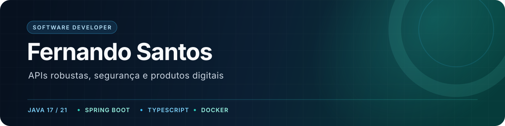

<p align="center">
  <a href="https://www.linkedin.com/in/fernando-p-santos/"></a>
  <a href="mailto:contatofernando2021@gmail.com"></a>
  <a href="https://github.com/lfernandops1?tab=repositories"></a>
</p>

## Sobre

Desenvolvedor de software com base forte em **Java e Spring Boot**, construindo APIs REST, fluxos de autenticação e soluções orientadas a domínio. Minha experiência inclui produtos públicos e privados com segurança, persistência relacional, observabilidade, ambientes em Docker e testes automatizados.

No ecossistema **TypeScript**, desenvolvo interfaces web, mobile e desktop com React, Angular, React Native, Expo e Electron. Essa combinação conecta uma base sólida de backend a experiências simples e funcionais.

```text
Backend          Java 17/21, Spring Boot, .NET e APIs REST
Engenharia       Segurança, domínio, testes e observabilidade
Infraestrutura   PostgreSQL, Docker, Flyway e Testcontainers
Produtos         React, Angular, React Native, Expo e Electron
```

## Stack principal

<p align="left">
  
  
  
  
  
  
  
  
  
  
  
  
  
  
  
</p>

## Experiência em produtos privados

Os estudos de caso abaixo representam trabalho mantido em repositórios privados. Para preservar confidencialidade, apresento somente o contexto técnico e os desafios de engenharia, sem nomes, links, clientes ou detalhes proprietários.

<table>
  <tr>
    <td width="50%" valign="top">
      <h3>Plataforma operacional multiaplicação</h3>
      <p>Ecossistema com APIs operacional e administrativa, portais web e aplicativos móveis para diferentes perfis. Abrange autorização por papéis, jornadas transacionais, auditoria e registros financeiros.</p>
      <p><code>Java 21</code> <code>Spring Boot</code> <code>PostgreSQL</code> <code>React</code> <code>Angular</code> <code>React Native</code></p>
    </td>
    <td width="50%" valign="top">
      <h3>Plataforma de oportunidades profissionais</h3>
      <p>Produto modular com identidade, MFA, sessões, perfis profissionais, organizações, equipes e publicação de oportunidades, acompanhado por métricas e controles de segurança.</p>
      <p><code>Java 21</code> <code>Spring Security</code> <code>Flyway</code> <code>Prometheus</code> <code>React 19</code> <code>Vitest</code></p>
    </td>
  </tr>
  <tr>
    <td width="50%" valign="top">
      <h3>Ferramenta desktop de dados e ativos</h3>
      <p>Editor para estruturas binárias e grandes coleções de ativos, com importação, exportação, operações em lote, undo/redo, verificação de consistência e distribuição para Windows.</p>
      <p><code>Electron</code> <code>React</code> <code>TypeScript</code> <code>Vite</code> <code>Vitest</code></p>
    </td>
    <td width="50%" valign="top">
      <h3>Produto social full stack</h3>
      <p>Aplicação modular com autenticação, registros de ocorrências, feed, conversas e alertas, integrando backend em C# com uma experiência web baseada em estado global e rotas protegidas.</p>
      <p><code>.NET</code> <code>C#</code> <code>React</code> <code>Redux Toolkit</code> <code>TypeScript</code></p>
    </td>
  </tr>
</table>

## Projetos públicos em destaque

<table>
  <tr>
    <td width="50%" valign="top">
      <h3><a href="https://github.com/lfernandops1/autenticacao-reserva-api">Autenticação e usuários</a></h3>
      <p>API completa de autenticação, autorização e gestão de usuários com JWT, refresh tokens, controle de acesso e histórico de operações.</p>
      <p><code>Java 17</code> <code>Spring Security</code> <code>PostgreSQL</code> <code>Testcontainers</code></p>
    </td>
    <td width="50%" valign="top">
      <h3><a href="https://github.com/lfernandops1/estoque-api">Controle de estoque</a></h3>
      <p>API para produtos, entradas e saídas de estoque, filtros dinâmicos e histórico de movimentações, com testes unitários e de integração.</p>
      <p><code>Spring Boot</code> <code>JPA</code> <code>Docker</code> <code>OpenAPI</code></p>
    </td>
  </tr>
  <tr>
    <td width="50%" valign="top">
      <h3><a href="https://github.com/lfernandops1/conversor-moeda">Conversor de moedas</a></h3>
      <p>Serviço reativo de conversão monetária com integração externa, validação de códigos, cache local e tratamento centralizado de erros.</p>
      <p><code>WebFlux</code> <code>Reactor</code> <code>Ehcache</code> <code>WireMock</code></p>
    </td>
    <td width="50%" valign="top">
      <h3><a href="https://github.com/lfernandops1/proj-mobile">Interface mobile</a></h3>
      <p>Fluxo de autenticação e cadastro mobile com navegação em etapas, validação de formulários e componentes responsivos.</p>
      <p><code>React Native</code> <code>Expo</code> <code>TypeScript</code> <code>Formik</code></p>
    </td>
  </tr>
</table>

## GitHub em números

<p align="center">
  
</p>

<p align="center">
  
  
</p>

---

<p align="center">
  <sub>Software bem construído começa com regras claras, código legível e decisões que resistem ao tempo.</sub>
</p>
