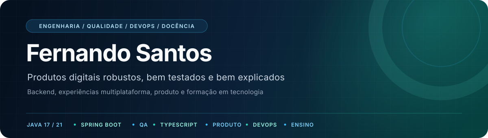

  
  
  

## Perfil

Sou **Engenheiro de Software, profissional de Qualidade de Software e Professor Universitário**. Minha atuação percorre o ciclo completo de um produto: descoberta e requisitos, arquitetura, desenvolvimento, testes, entrega contínua, observabilidade, documentação e formação de profissionais de tecnologia.

Tenho base forte em **Java e Spring Boot** para construção de APIs, segurança e soluções orientadas a domínio. No ecossistema **TypeScript**, desenvolvo experiências web, mobile e desktop com React, Angular, React Native, Expo e Electron. Conecto essas competências a práticas de **QA, DevOps, CI/CD, containers e observabilidade**.

> Transformo regras de negócio complexas em produtos compreensíveis, testáveis e sustentáveis.

<table>
  <tr>
    <td width="25%" valign="top">
      <h3>Engenharia</h3>
      
APIs, arquitetura, segurança, persistência, integração e sistemas distribuídos.

    </td>
    <td width="25%" valign="top">
      <h3>Qualidade</h3>
      
Estratégia de testes, regressão, rastreabilidade e investigação ponta a ponta.

    </td>
    <td width="25%" valign="top">
      <h3>Produto</h3>
      
Requisitos, jornadas, casos de uso, backlogs, viabilidade e decisões técnicas.

    </td>
    <td width="25%" valign="top">
      <h3>Docência</h3>
      
Aulas práticas, avaliações, laboratórios e formação em Ciência da Computação.

    </td>
  </tr>
</table>

## Atuação profissional

### Qualidade de Software — Toledo do Brasil

- Planejamento e execução de validações funcionais e regressivas.
- Organização de mudanças de release em frentes testáveis e rastreáveis.
- Investigação de autenticação, autorização, permissões, logs, exceções e integrações.
- Contribuição com melhorias em UI/UX, qualidade, código, arquitetura e processos ágeis.

### Professor Universitário — UNINASSAU

- Planejamento e condução de disciplinas em Ciência da Computação.
- Produção de aulas, apresentações, avaliações, roteiros e atividades práticas.
- Uso de live coding, Postman, Tinkercad, estudos de caso e avaliação diagnóstica.
- Tradução de conceitos complexos em sequências didáticas progressivas e aplicáveis.
- Formação multidisciplinar em engenharia, arquitetura, requisitos, qualidade, DevOps, redes, liderança, comunicação e fundamentos da computação.

## Do requisito à operação

Atuo de forma integrada em diferentes etapas do ciclo de software:

| Descoberta | Estrutura | Construção | Entrega | Confiança | Evolução |
|---|---|---|---|---|---|
| Requisitos, stakeholders e valor | Arquitetura, dados e decisões | APIs e experiências multiplataforma | CI/CD, containers e orquestração | Testes, métricas e rastreabilidade | Logs, observabilidade e aprendizado |

Essa visão orienta meus projetos, minha documentação e a forma como organizo aulas e atividades práticas.

## Experiência em produtos privados

Também atuo em projetos mantidos em repositórios privados. Para respeitar a confidencialidade, descrevo apenas os desafios, minhas contribuições e as tecnologias utilizadas, sem expor nomes, links, clientes ou informações proprietárias.

<table>
  <tr>
    <td width="50%" valign="top">
      <h3>Plataforma de transporte e logística</h3>
      
Ecossistema com APIs operacional e administrativa, painel web e dois aplicativos móveis para clientes e motoristas. Inclui papéis, jornadas transacionais, upload de documentos, aprovação e operação em tempo real.

      
<code>Java 21</code> <code>Spring Boot</code> <code>PostgreSQL</code> <code>Angular</code> <code>React Native</code> <code>Expo</code>

    </td>
    <td width="50%" valign="top">
      <h3>Plataforma de oportunidades profissionais</h3>
      
Produto modular planejado da fundação técnica aos fluxos de identidade, MFA, sessões, perfis, currículos, organizações, oportunidades, candidaturas, propostas e moderação.

      
<code>Java 21</code> <code>Spring Security</code> <code>Flyway</code> <code>Prometheus</code> <code>React 19</code> <code>Testcontainers</code>

    </td>
  </tr>
  <tr>
    <td width="50%" valign="top">
      <h3>Ferramenta desktop de dados e ativos</h3>
      
Editor de estruturas binárias e grandes coleções de ativos com importação, exportação, operações em lote, undo/redo, consistência, backups, rollback e distribuição para Windows.

      
<code>Electron</code> <code>React</code> <code>TypeScript</code> <code>Vite</code> <code>Vitest</code>

    </td>
    <td width="50%" valign="top">
      <h3>Produto social e de ocorrências</h3>
      
Aplicação modular com autenticação, ocorrências, feed, conversas, alertas, rotas protegidas e backlog coordenado entre múltiplos repositórios.

      
<code>.NET</code> <code>C#</code> <code>React</code> <code>Redux Toolkit</code> <code>TypeScript</code>

    </td>
  </tr>
  <tr>
    <td width="50%" valign="top">
      <h3>RPG de captura e evolução</h3>
      
Projeto autoral com GDD, progressão, combate automático, áreas de caça, captura, habilidades e evolução. A documentação separa regras confirmadas, parciais, pendentes e futuras.

      
<code>Game Design</code> <code>Domínio</code> <code>Vertical Slice</code> <code>Sprites</code> <code>Prototipação</code>

    </td>
    <td width="50%" valign="top">
      <h3>Inteligência de custo para motoristas</h3>
      
Concepção de produto que combina preços colaborativos de combustível, geolocalização, leitura de imagens e cálculo de rentabilidade de corridas e entregas.

      
<code>Product Discovery</code> <code>OCR</code> <code>Geolocalização</code> <code>Rotas</code> <code>Dados colaborativos</code>

    </td>
  </tr>
</table>

## Projetos públicos em destaque

<table>
  <tr>
    <td width="50%" valign="top">
      <h3><a href="https://github.com/lfernandops1/autenticacao-reserva-api">Autenticação e usuários</a></h3>
      
API de identidade, autorização e gestão de usuários com JWT, refresh tokens, revogação, papéis, políticas de senha e histórico de operações.

      
<code>Java 17</code> <code>Spring Security</code> <code>PostgreSQL</code> <code>Testcontainers</code>

    </td>
    <td width="50%" valign="top">
      <h3><a href="https://github.com/lfernandops1/estoque-api">Controle de estoque</a></h3>
      
API para produtos, entradas, saídas, histórico de movimentações e filtros dinâmicos, com testes unitários e de integração.

      
<code>Spring Boot</code> <code>JPA</code> <code>Docker</code> <code>OpenAPI</code>

    </td>
  </tr>
  <tr>
    <td width="50%" valign="top">
      <h3><a href="https://github.com/lfernandops1/conversor-moeda">Conversor de moedas</a></h3>
      
Serviço reativo com integração externa, validação de códigos, cache local, tratamento centralizado de falhas e testes de contrato.

      
<code>WebFlux</code> <code>Reactor</code> <code>Ehcache</code> <code>WireMock</code>

    </td>
    <td width="50%" valign="top">
      <h3><a href="https://github.com/lfernandops1/proj-mobile">Autenticação mobile</a></h3>
      
Fluxo de acesso e cadastro em etapas, com navegação, formulários validados e componentes responsivos.

      
<code>React Native</code> <code>Expo</code> <code>TypeScript</code> <code>Formik</code>

    </td>
  </tr>
  <tr>
    <td width="50%" valign="top">
      <h3><a href="https://github.com/lfernandops1/todolist">API de tarefas</a></h3>
      
Serviço para criação, acompanhamento, atualização e filtragem de tarefas.

      
<code>Java</code> <code>Spring Boot</code> <code>PostgreSQL</code> <code>Docker</code> <code>JUnit</code>

    </td>
    <td width="50%" valign="top">
      <h3>Outros repositórios</h3>
      
Projetos de estudo, provas de conceito e implementações voltadas a APIs, interfaces e experimentação de tecnologias.

      
<a href="https://github.com/lfernandops1?tab=repositories">Explorar todos os repositórios públicos</a>

    </td>
  </tr>
</table>

## Docência e produção de conhecimento

Na docência, conecto fundamentos, engenharia, operação e competências humanas. Organizo as aulas a partir de problemas reconhecíveis, avanço pelos conceitos de forma progressiva e concluo com aplicação, análise ou prática.

| Disciplina | Abordagem |
|---|---|
| **Back-End Frameworks** | Java, Spring Boot, HTTP, REST, injeção de dependência, arquitetura em camadas, persistência e testes de API. |
| **Engenharia de Software** | Processos, métodos ágeis, histórias de usuário, critérios de aceite, backlog e decisões de projeto. |
| **Engenharia de Requisitos** | Elicitação, stakeholders, análise, UML, casos de uso, user stories, priorização, SRS, validação e rastreabilidade. |
| **Arquitetura de Software** | Decisões e trade-offs, stakeholders, visões, estilos clássicos, SOA, microsserviços, sistemas distribuídos e documentação arquitetural. |
| **Fábrica de Software** | Estratégia, viabilidade, métodos de desenvolvimento, infraestrutura, escopo, tempo, custos, qualidade, equipes, comunicação, riscos e aquisições. |
| **Teste de Software** | Qualidade orientada a risco, causa raiz, testes estáticos e dinâmicos, caixa-preta e caixa-branca, decisão, estados, exploração, planejamento e métricas. |
| **DevOps** | Cultura e colaboração, Ágil, CI/CD, máquinas virtuais, containers, Docker, Kubernetes, Helm, logs e observabilidade. |
| **Redes de Computadores** | Evolução e tipos de redes, topologias, modelos OSI e TCP/IP, DNS, TCP/UDP e protocolos de aplicação. |
| **Gestão de Times em TI** | Estruturas de equipe, gestão macro e micro, comunicação, modelos tradicionais, crise do software, Scrum e Kanban. |
| **Storytelling** | Estrutura narrativa, conexão e significado, arquétipos, roteiro, comunicação técnica, games e design. |
| **Linguagens Formais e Autômatos** | Gramáticas, expressões regulares, AFD/AFN, autômatos com pilha, Turing e decidibilidade. |
| **Tópicos Avançados em Computação** | Stacks, arquiteturas, trade-offs, ADRs, SPA, SSR, BFF, mobile e critérios de decisão técnica. |
| **Microcontroladores e Microprocessadores** | Arduino, eletrônica, GPIO, sensores, PWM, interrupções, UART, I2C, SPI e máquinas de estado. |

## Stack e práticas

Tecnologias presentes nos meus projetos e práticas que aplico no trabalho, na construção de produtos e na docência.

<table>
  <tr>
    <td width="50%" valign="top">
      <h3>Backend e APIs</h3>
      

        
        
        
        
        
        
      

      
<strong>Práticas:</strong> REST, JWT, autorização por papéis, validação, tratamento de erros, programação reativa, integrações e contratos de API.

    </td>
    <td width="50%" valign="top">
      <h3>Arquitetura e requisitos</h3>
      
<code>Arquitetura em camadas</code> <code>Monólito modular</code> <code>SOA</code> <code>Microsserviços</code> <code>Sistemas distribuídos</code> <code>UML</code> <code>ADRs</code>

      
<strong>Práticas:</strong> decisões e trade-offs, visões arquiteturais, elicitação, stakeholders, casos de uso, user stories, SRS, priorização, validação e rastreabilidade.

    </td>
  </tr>
  <tr>
    <td width="50%" valign="top">
      <h3>Web, mobile e desktop</h3>
      

        
        
        
        
        
        
        
        
      

      
<strong>Práticas:</strong> componentização, gerenciamento de estado, navegação, formulários, responsividade, fluxos por perfil e aplicações multiplataforma.

    </td>
    <td width="50%" valign="top">
      <h3>Qualidade e testes</h3>
      

        
        
        
        
        
        
        
      

      
<strong>Práticas:</strong> testes funcionais e regressivos, análise de risco, caixa-preta e caixa-branca, testes estáticos e dinâmicos, decisão e estados, exploração, causa raiz, cobertura e métricas.

    </td>
  </tr>
  <tr>
    <td width="50%" valign="top">
      <h3>DevOps, infraestrutura e redes</h3>
      

        
        
        
        
        
        
        
        
        
      

      
<strong>Práticas:</strong> cultura DevOps, CI/CD, versionamento, builds automatizados, máquinas virtuais, containers, volumes, orquestração, configuração e deploy; modelos OSI e TCP/IP, DNS, TCP/UDP e protocolos de aplicação.

    </td>
    <td width="50%" valign="top">
      <h3>Dados e observabilidade</h3>
      

        
        
        
        
      

      
<strong>Práticas:</strong> modelagem relacional, migrações versionadas, persistência, cache, logs centralizados, métricas, rastros, correlação de requisições e investigação de falhas.

    </td>
  </tr>
  <tr>
    <td width="50%" valign="top">
      <h3>Produto e gestão</h3>
      
<code>Scrum</code> <code>Kanban</code> <code>Lean</code> <code>MoSCoW</code> <code>MVP</code> <code>EAP/WBS</code> <code>RACI</code> <code>ISO/IEC 25010</code>

      
<strong>Práticas:</strong> descoberta, viabilidade, escopo, estimativas, custos, riscos, backlog, critérios de aceite, gestão de mudanças, comunicação e entrega de valor.

    </td>
    <td width="50%" valign="top">
      <h3>Ensino e comunicação</h3>
      
<code>Live coding</code> <code>PBL</code> <code>Storytelling</code> <code>Estudos de caso</code> <code>Laboratórios</code> <code>Rubricas</code>

      
<strong>Práticas:</strong> planejamento didático, avaliação diagnóstica, construção progressiva de conceitos, documentação técnica, facilitação, roteiros e aprendizagem baseada em problemas.

    </td>
  </tr>
</table>

## GitHub em números

  

  
  

## Contato

Estou aberto a conversas sobre **engenharia de software, qualidade, arquitetura de produtos, documentação técnica e educação em tecnologia**.

- [LinkedIn](https://www.linkedin.com/in/fernando-p-santos/)
- [E-mail](mailto:contatofernando2021@gmail.com)
- [Repositórios públicos](https://github.com/lfernandops1?tab=repositories)

---

  Software bem construído começa com regras claras, código legível e decisões que resistem ao tempo.

